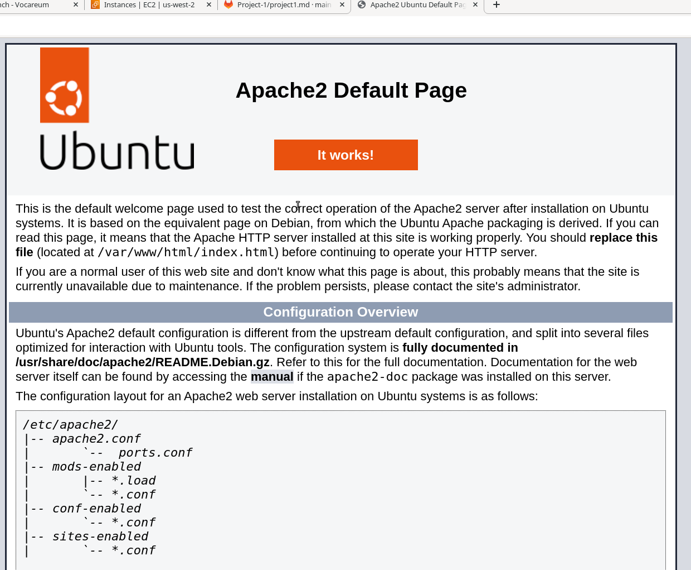
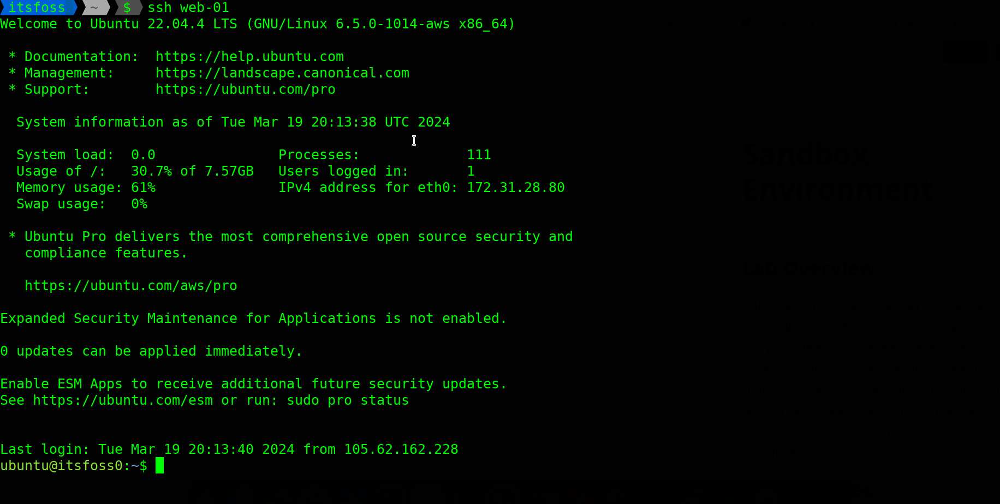
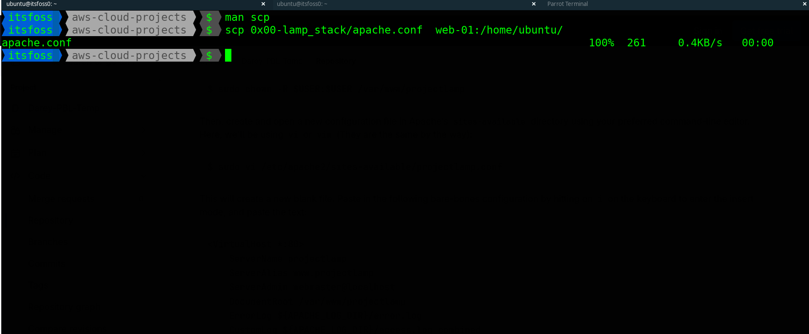
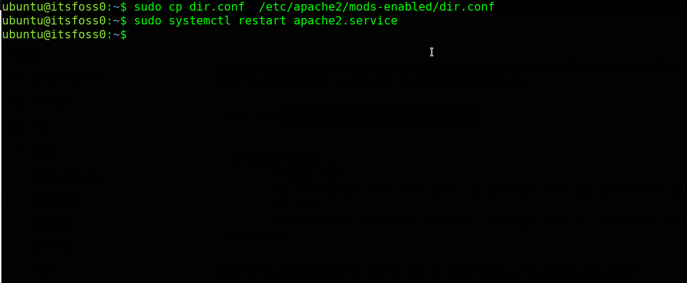
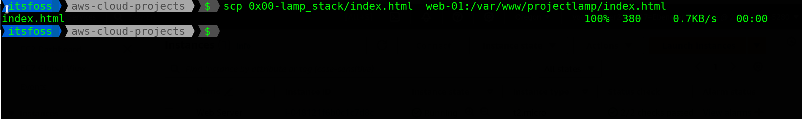
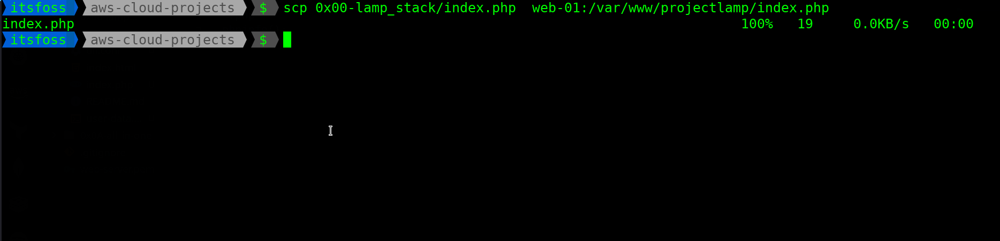

## Deploying a LAMP stack application to AWS

In this project, I deploy a LAMP stack application to AWS. Before we get into it, Lets quickly define what a LAMP stack application is.  LAMP is a web stack made up of Linux, Apache, MySQL, PHP or Python, or Perl

This documentation is broken down into two sections, section one describes how to deploy manually, by doing lots of clicking and typing. What the ancestors called _clickops_, which is good for people just getting started. The second section uses automation concepts (IAC), we use terraform to provision the infrastructure and configure it with ansible. 


## Section 1 - Setting up manually. 
Select EC2 service on the Management console, and launch an instance, configure the following. 
- AMI - ubuntu
- Instace type - A general purpose t2 micro will do just fine. (free tier eligible)
- key pair - create a new key pair (To be able to ssh into the instance) or select one if one already exists and you have access to it. 
- security group - Allow ingress traffic on port 22, 80 and 443. Then allow all egress.
- user data - enter the script in the [user data file](./user-data.sh)
Create. 

If all went well, when you visit the public IP of your instance (http), you should be greeted with the default apache page. 



To change the default page, we'll need to ssh into the instance we just created. 

SSH into the instance you just created using the command 
```
chmod  400 /path/to/key-file.pem
```

```
ssh ubuntu@<PUBLIC-IP> -i /path/to/key-file.pem
```

A really cool trick to do at this point is to configure the ssh client by setting up host and server alive intervals. This helps you to stay connected to the session even when you are not actively using it. We'll need this since we'll be working from more than one terminal.  Here is my config. (No, the IP's here are not actual ones :laugh: )

```ssh
# ~/.ssh/config
Host * 
  ServerAliveInterval 60
  ForwardAgent yes

Host web-01
  Hostname 54.212.164.169
  IdentityFile /home/USER/path/to/aws-cloud-projects/web-server.pem
  User ubuntu


Host web-02
  Hostname  52.26.10.99
  IdentityFile /home/USER/path/to/aws-cloud-projects/web-server.pem
  User ubuntu
```

This lets you ssh with ease by simply typing ```ssh <host>``` where _host_ is what we configured  in the ```~/.ssh/config``` file above. 




On another terminal, lets copy the files needed from our local machine to the instance we just created. 
We'll be using the `scp` utility. Its part of the openssh-client so no extra tooling needed to have it on your machine. 





