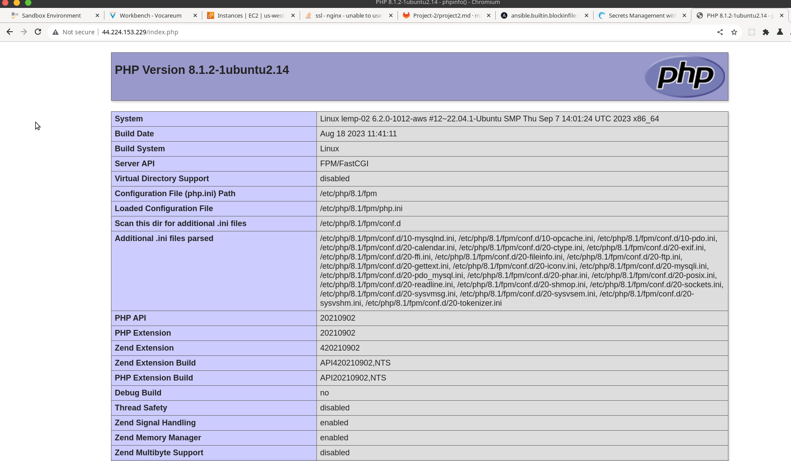

# LEMP Stack

__Deploying a LEMP stack applicaion to AWS using terraform and ansible__. 

## Steps

### Setup

1. First, we needed to have the aws cli installed. A quick peek at the [docs](https://docs.aws.amazon.com/cli/latest/userguide/getting-started-install.html) proved to be very useful.
2. We will also need ansible installed on our system. Ansible depends on python, it'll be a good idea to have it installed beforehand. Follow the [docs](https://docs.ansible.com/ansible/latest/installation_guide/intro_installation.html) to set it up.
3. Finally, we will also need to have terraform installed. You can follow the [documentation](https://developer.hashicorp.com/terraform/tutorials/aws-get-started/install-cli) to install it. 
2. Lastly. we need to configure our aws cli with an access key and a secret key for an IAM user. Create an IAM user from the AWS management console and copy the access key and the secret key.

Next, run the command `aws configure`  and follow the prompts to configure the default aws region, output and setting up the access and secret key. This will create two files in an `aws` directory of the current user, with contents simillar to these. 

Config


Access keys


### Execution
First of, you'll need to create a key pair from the EC2 dashboard called __web-server__. 

Run `terraform plan` to see the changes that terraform will make on the infrastructure. 
Next on, run `terraform apply -auto-approve` to effect the changes.


```shell
user@host:~ terraform apply -auto-aprove
```

This might take a second, so grab your coffee as you wait. 


Lets quickly create an ansible vault. 

```
user@host:~ ansible-vault  create ansible/secrets.yaml
New Vault password: 
Confirm New Vault password:
```
You will be prompted for a password and asked to confirm it. It won't be displayed while you type it. 

A text editor will pop up for you to populate your secrets, make sure you have: 
- DB_USER
- DB_NAME
- DB_PASS
- TABLE_NAME

In the following format.

`DB_NAME: foo_bar_baz `


Copy the web-server.pem key we created earlier somewhere and make it write protected by running 


```
user@host:~ cp /home/$USER/Downloads/web-server.pem .
user@host:~ chmod 400 web-server.pem
```

From the AWS management console, on the EC2 tab, find the running instance(LEMP project Web server ) and copy the public IP address. Paste the IP address you just copied to the inventory file hosts.ini, right under the [server] block

Finally run 

```shell
ansible-playbook  --private-key web-server.pem  -i ansible/hosts.ini ansible/lemp.yaml  --vault-id @prompt
```
You will be prompted for the password you just used when creating the vault up above. 

Let the spirits of AWS do their their thing. 

Try accessing the server by sending http requests to the IP address you just copied. 


__Index page__ :  < IP > 


__PHP info Page__ < IP >/index.php



__Todo Page__: < IP >/todo.php


Thats it for this one, thanks for coming to my TED talk.